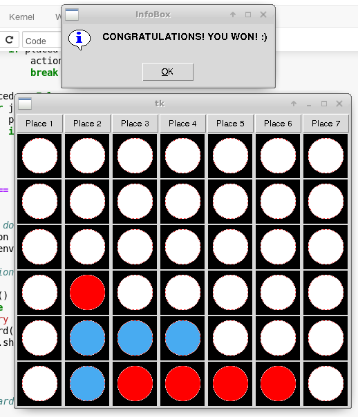

- Team name: Sitiro
- Title: Connect-4 with DQN and Minimax
- Team member: Sotirios Nikoloutsopoulos

### Description
The Connect-4 is a two-player game. The game consists of a 6x7 board, at each turn every player drops a piece ( each player has a unique color ) in one of the 7 available columns ( a column is not available if it is full ). The winner is the player who will first connect 4 pieces of his/her unique color in a row ( horizontally, vertically or diagonally ).

### Environment
The environment is custom-made.

State: An integer 6x7 board, where for each position in the board
    - 0 means the slot is free
    - 1 means there is a red piece
    - 2 means there is blue piece

Reward:
    - +1 if player wins
    - -1 if players loses
    - 0 for intermedian states

### DQN Agents
The DQN agent was self-trained but i didn't use 2 dqn agents seperately. I only trained 1 DQN agent and the 2nd dqn agent just reverse the state when its about to take a decision in order to feed it in the neural network. By reverse i mean that 1->2 and viceversa 2->1. ( Unfortunately i only used only fully-connected layers, although convolutional layers maybe would help because the board can be seen as an image, therefore the convolutional layer could help the agent to learn local features ). Also in order to make the learning more stable i used a fixed network that is updated by a frequency rate.

### Minimax
Alternatively instead of using the DQN agent to decide which action to take, i used Minimax, although the heuristic function is simplistic ( it's a constant
take i took the "depth" into consideration => number of turns till the end of the game ).

### Imitation learning
Then next step would be to apply imitation learning and to achieve that i would try that with the GUI i prepared ( instead of using the input() function )

### GUI
    Finally the game can be played via the GUI against DQN or Minimax

    
